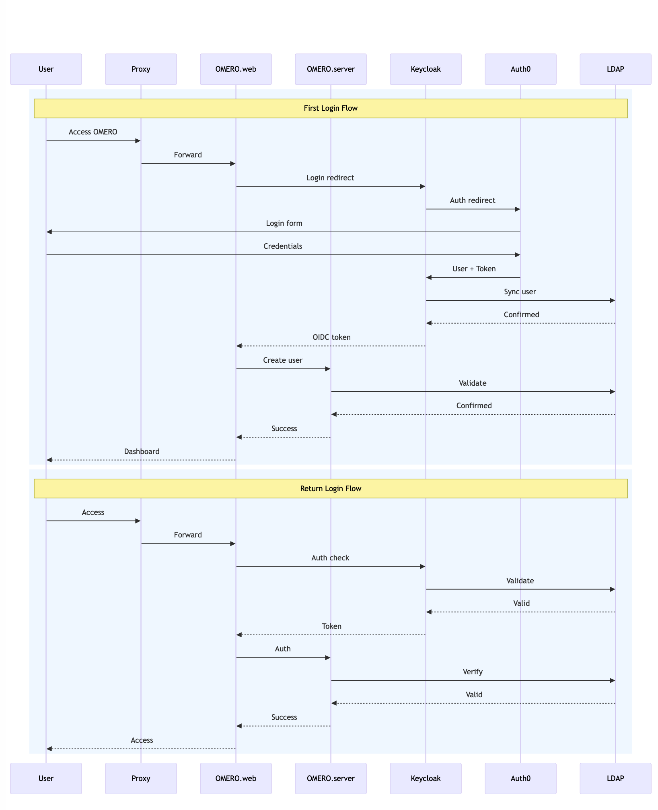

# Installation Guide: OIDC with OMERO

This guide explains how to implement OIDC authentication for OMERO using Keycloak, OpenLDAP, and Auth0, and test the setup. Follow the steps below to configure and run the system.

## Architecture Overview

We will integrate the following components:

- **Keycloak** for identity and access management.
- **OpenLDAP** as a buffer to OMERO.
- **Auth0** for primary authentication.

### Prerequisites

Ensure you have the following ports open:
- Ngrok, OpenLDAP, and Keycloak.
- Refer to [Security and Ports](https://github.com/DBK333/Omero-DataPortal/blob/main/SECURITY.MD) for detailed port configurations.
- **For Nectar VM users:** Create a security group with the necessary ports open. The setup script only configures the firewall, not the security group.

Ensure you have the following:
- An **NGROK account** (for authentication token).

## Authentication Flow



## Installation Steps

### Step 1: Clone the Omero-DataPortal Repository

Clone the repository containing the necessary files for OIDC setup:

```bash
git clone https://github.com/DBK333/Omero-DataPortal
cd Omero-DataPortal/InstallationOIDC/
```

### Step 2: Retrieve NGROK_AUTH_TOKEN from the Ngrok Dashboard

1. Log in to the [Ngrok dashboard](https://dashboard.ngrok.com/).
2. Navigate to **Getting Started > Your Auth Token**.
3. Save the authentication token in the terminal:

```bash
echo "NGROK_AUTH_TOKEN=your_token_here" > .env
```

### Step 3: Grant Execute Permissions and Run the Setup Script

Make the setup script executable and run it:

```bash
chmod +x OIDCSetup.sh
sudo ./OIDCSetup.sh
```

### Step 4: Set Up Auth0

Follow the Auth0 documentation to configure authentication settings for OMERO.

1. Sign up at [Auth0 Signup](https://auth0.com/signup?place=header&type=button&text=sign%20up).
2. Log in to your Auth0 account.
3. In the Auth0 dashboard, go to **User Management > Users** and create test user accounts.
4. Create an application:
   - Navigate to **Applications > Create Application**.
   - Enter a name for your test application and select **Regular Web Applications**.
5. Configure application settings:
   - Go to the **Application URIs** section.
   - Set **Allowed Callback URLs** to:
     ```
     https://[ngrok_url_here]/realms/MyRealm/broker/Auth0/endpoint
     ```
   - Set **Allowed Logout URLs** to:
     ```
     https://[ngrok_url_here]/realms/MyRealm/broker/Auth0/endpoint/logout_response
     ```
   - Alternatively, copy the **Redirect URL** from **Keycloak Admin Dashboard > Identity Provider > Redirect URL**.
6. Save the changes. Your Auth0 setup is now complete.
7. Please refer to 
   -[Auth0 Setup](https://wehieduau.sharepoint.com/:w:/r/sites/StudentInternGroupatWEHI/_layouts/15/Doc.aspx?sourcedoc=%7B0F5FB55E-3EED-4418-B4A9-A0C502F5FE94%7D&file=Auth0%20Okta%20Set%20Up.docx&action=default&mobileredirect=true)

### Step 5: Set Up Keycloak

1. In a new tab, visit:
   ```
   https://[Auth0_given_URL]/.well-known/openid-configuration
   ```
   and save the file.
2. Access the Keycloak UI:
   - From the dashboard, navigate to **Universal Gateway > Endpoints** and copy the generated link.
3. Log in with the default credentials:
   - **Username:** `admin`
   - **Password:** `admin`
4. Go to **Identity Provider** and select **OpenID Connect v1.0**.
5. Configure the connection:
   - Change **Alias** to `Auth0` and **Display Name** to `Auth0`.
   - Disable **Use Discovery Endpoint** and upload the previously downloaded `.json` file.
   - Copy and paste the **Client ID** and **Client Secret** from Auth0.
6. Configure LDAP settings:
   - Set **Connection URL** to `ldap://openldap:1389`.
   - Choose **Bind Type:** `Simple`.
   - Enter:
     - **Bind DN:** `cn=admin,dc=example,dc=com`
     - **Bind Credentials:** `adminpassword`
   - Click **Test Connection** and **Test Authentication**.
   - Set **Users DN** to `ou=users,dc=example,dc=com` (modifiable as needed).
7. Enable synchronization:
   - In **Synchronization Settings**, enable **Import Users** and **Sync Registration**.
   - Click **Save**.
8. Test login via:
   ```
   https://[Ngrok_given_URL]/realms/MyRealm/account
   ```
   _Note: There may be an issue with updating accounts; further mapping and config is needed._

9. Please refer to
- [Keycloak Fully Functioning Setup](https://wehieduau.sharepoint.com/:w:/r/sites/StudentInternGroupatWEHI/_layouts/15/Doc.aspx?sourcedoc=%7BE5E013C2-B59C-409F-8775-DC21E0F98F26%7D&file=KeyCloak%20Set%20Up.docx&action=default&mobileredirect=true)
- [Possible Config Solution](https://auth0.com/blog/identity-in-spring-boot-with-kubernetes-keycloak-and-auth0/)

### Step 6: Set Up OpenLDAP

1. Navigate to **Keycloak Admin Dashboard > User Federation > Add LDAP Provider**.
2. Configure LDAP settings:
   - Set **Display Name** as desired.
   - Select **Vendor** as `Active Directory`.
3. Save the configuration.

_Additional configuration and testing is required for full functionality for Keycloak, Auth0, and OpenLDAP._

## References

For more detailed information and troubleshooting, refer to the following resources:

- [OMERO LDAP Update Discussion](https://forum.image.sc/t/update-ldap-from-omero/64070/29)
- [Redmane Auth Repository](https://github.com/varshithmee/redmane-auth/)
- [OMERO Deployments on GitLab](https://gitlab.in2p3.fr/fbi-data/websites/OmeroDeployments)
- [Keycloak Setup](https://wehieduau.sharepoint.com/:w:/r/sites/StudentInternGroupatWEHI/_layouts/15/Doc.aspx?sourcedoc=%7B661B9E61-85EE-4E6C-B55C-2C2A5CC3A3C3%7D&file=Set%20up%20Keycloak%20on%20the%20Nectar%20VM.docx&action=default&mobileredirect=true)
- [Keycloak, MariaDB, and OpenLDAP Guide](https://bamhm182.notion.site/Keycloak-Mariadb-and-OpenLDAP-d1587c81353c42e598526cae9c8f5efd)

