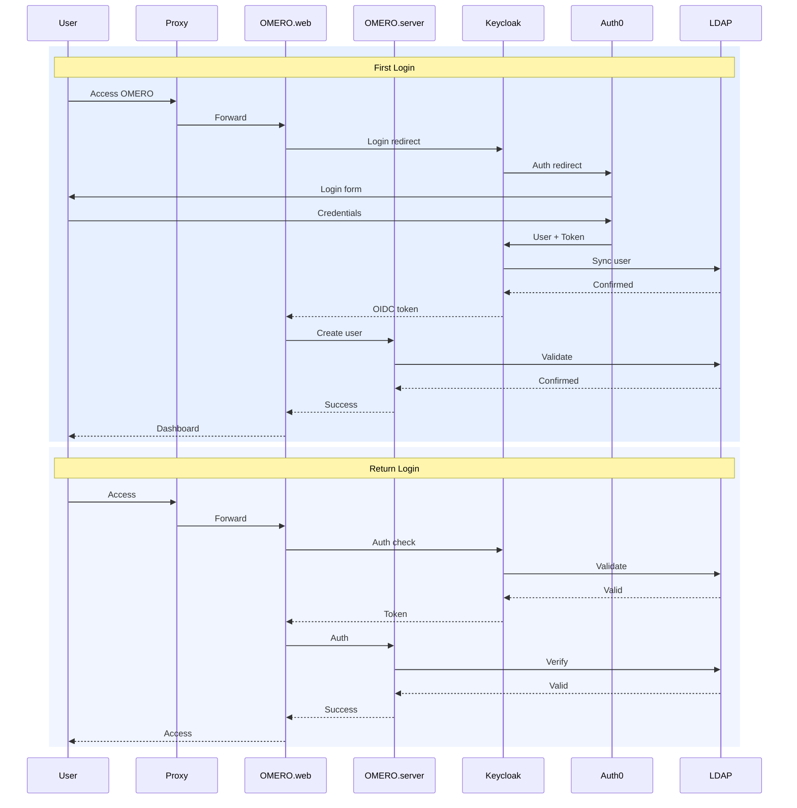

# Authentication Flow Diagram

```mermaid
sequenceDiagram
    participant User
    participant Proxy
    participant Web as OMERO.web
    participant Server as OMERO.server
    participant Keycloak
    participant Auth0
    participant LDAP

    rect rgb(230, 240, 255)
        Note over User,LDAP: First Login
        User->>Proxy: Access OMERO
        Proxy->>Web: Forward
        Web->>Keycloak: Login redirect
        Keycloak->>Auth0: Auth redirect
        Auth0->>User: Login form
        User->>Auth0: Credentials
        Auth0->>Keycloak: User + Token
        Keycloak->>LDAP: Sync user
        LDAP-->>Keycloak: Confirmed
        Keycloak-->>Web: OIDC token
        Web->>Server: Create user
        Server->>LDAP: Validate
        LDAP-->>Server: Confirmed
        Server-->>Web: Success
        Web-->>User: Dashboard
    end

    rect rgb(240, 245, 255)
        Note over User,LDAP: Return Login
        User->>Proxy: Access
        Proxy->>Web: Forward
        Web->>Keycloak: Auth check
        Keycloak->>LDAP: Validate
        LDAP-->>Keycloak: Valid
        Keycloak-->>Web: Token
        Web->>Server: Auth
        Server->>LDAP: Verify
        LDAP-->>Server: Valid
        Server-->>Web: Success
        Web-->>User: Access
    end
```