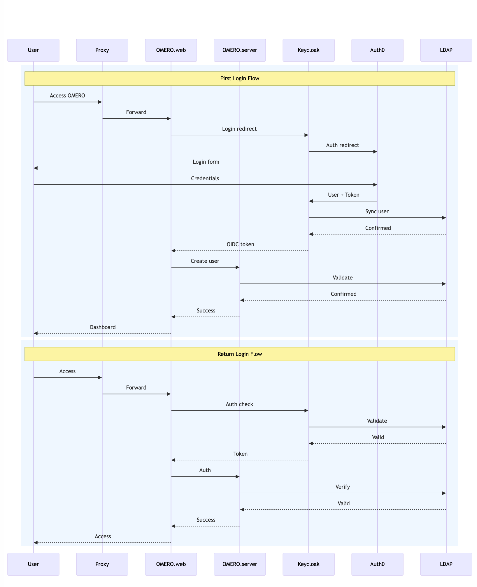

# Omero-DataPortal
This deployment assumes installation on a single instance while deploying OMERO with its OIDC components.

## Installation

Follow these steps to install and set up the portal.

### Prerequisites

Ensure the following ports are open:
- OMERO Web and Server
- Ngrok, OpenLDAP, and Keycloak
- Refer to [Security and Ports](https://github.com/DBK333/Omero-DataPortal/blob/main/SECURITY.MD) for detailed port configuration numbers.
- **For Nectar VM users:** Create a security group with the necessary ports open. The setup script configures the firewall but does not modify the security group.

Ensure you have:
- An **NGROK account** (for authentication token generation)

### Clone the Repository

```sh
git clone https://github.com/DBK333/Omero-DataPortal.git
cd Omero-DataPortal/InstallationOmeroWithOIDC
```

### Set Up Environment Variables

Replace `your_token_here` with your actual NGROK authentication token:

```sh
echo "NGROK_AUTH_TOKEN=your_token_here" > .env
```

### Run the Setup Script

Ensure the script has execution permissions, then run it with sudo:

```sh
chmod +x setup.sh
sudo ./setup.sh
```

## Usage

Once the deployment is complete, OMERO and OIDC components should be running. You can access OMERO via the provided URL once NGROK establishes a tunnel.

## Authentication Flow



### Accessing Keycloak

1. Identify the public NGROK URL after deployment.
2. Navigate to `https://your_ngrok_url/` in your browser.
3. Log in using your Keycloak credentials. For further details, refer to the [OIDC Configuration Guide](https://github.com/DBK333/Omero-DataPortal/tree/main/InstallationOIDC).
   - **Username:** `admin`
   - **Password:** `admin`

### Configuring OIDC and Authentication

To configure Keycloak to connect to OpenLDAP and Auth0 for OIDC authentication, refer to the [OIDC Configuration Guide](https://github.com/DBK333/Omero-DataPortal/tree/main/InstallationOIDC).

### Accessing OMERO Web

To access the OMERO web interface:
Open the NGROK URL in your browser and append the OMERO Web port.
- If OMERO Web is still unreachable, ensure the NGROK tunnel is correctly configured and all required ports are open.
- Additional configuration may be required for full OMERO Web accessibility through NGROK.

## OMERO Data Management

### OMERO Data Samples
Refer to [OMERO Image Samples](https://github.com/DBK333/Omero-DataPortal/tree/main/OmeroImageSamples).

### OMERO Data Upload
Refer to [Data Upload Guide](https://github.com/DBK333/Omero-DataPortal/blob/main/DATAUPLOAD.MD).

## Troubleshooting

- If the setup script fails, ensure Docker is running and that you have provided the correct NGROK token.
- Check logs using:
  ```sh
  docker logs <container_id>
  ```
  for more details.

## Reference

For additional reference, see:
- [OMERO Docker Example with LDAP](https://github.com/ome/docker-example-omero-ldap)

## Deployment Status

| Component                  | Status                 |
|----------------------------|------------------------|
| Deployment Code            | ✅ Fully functional    |
| OIDC Component             | ✅ Fully functional    |
| OMERO Server & Web         | ✅ Fully functional    |
| OIDC and OMERO Configuration | ⚠️ Partially functional |
| Reverse Proxy              | ❌ Not developed (needs further work) |

